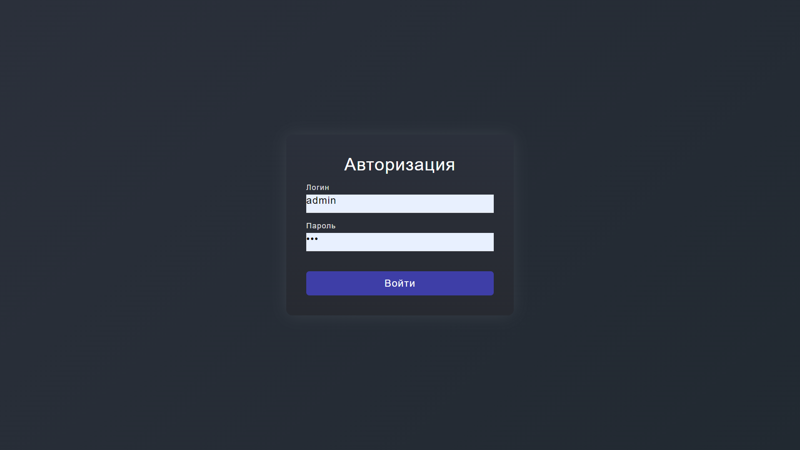
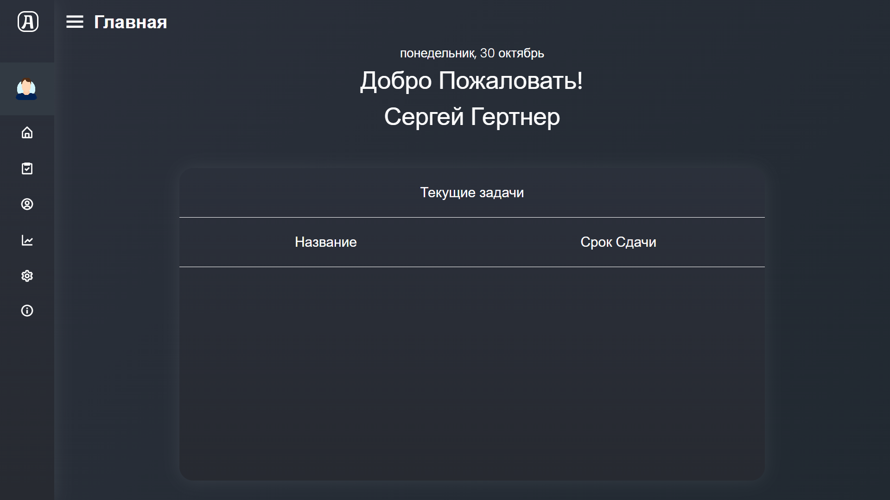
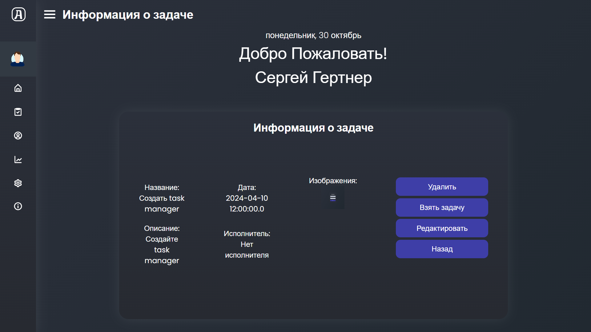
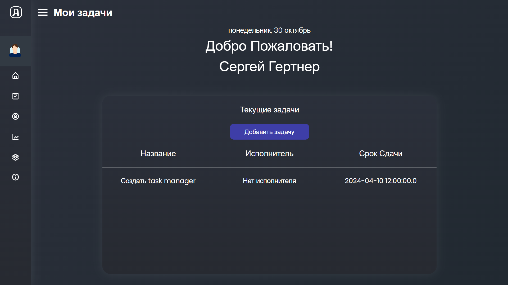
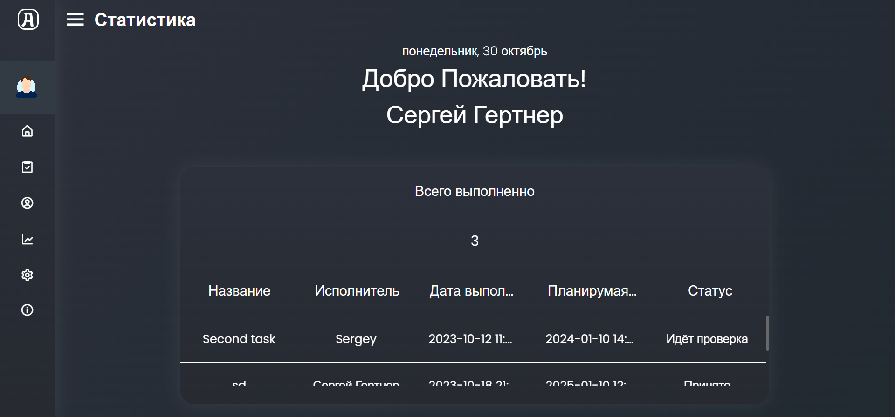
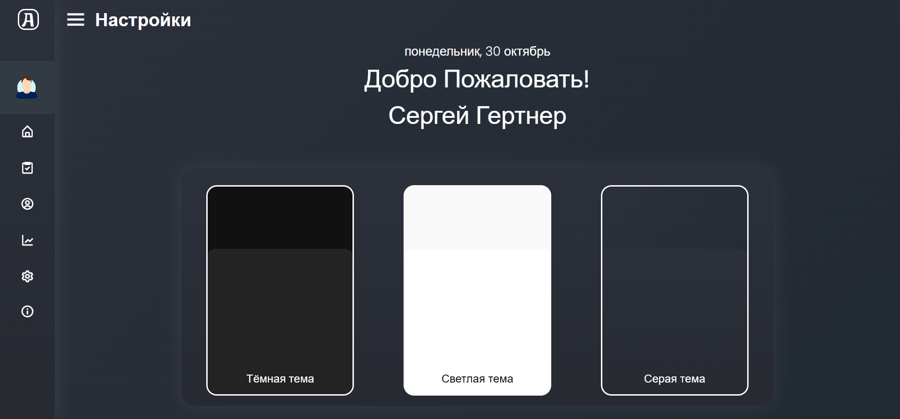
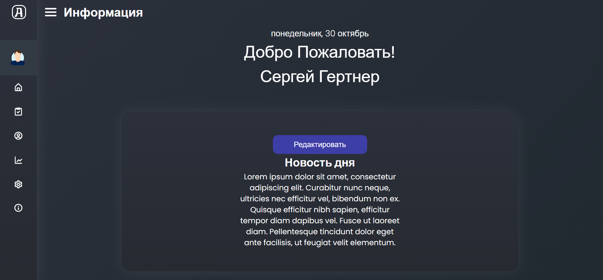
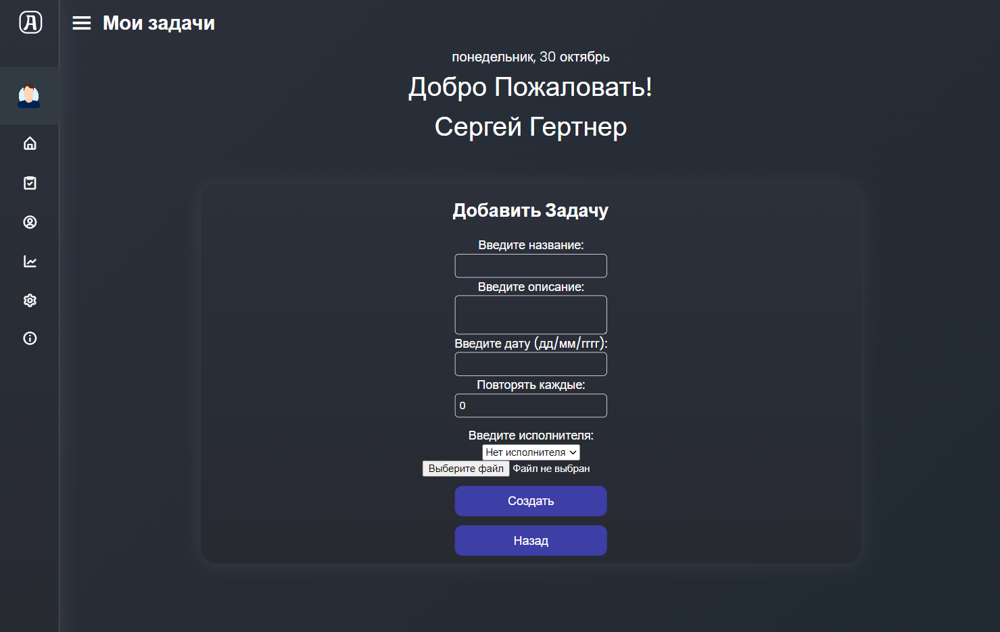
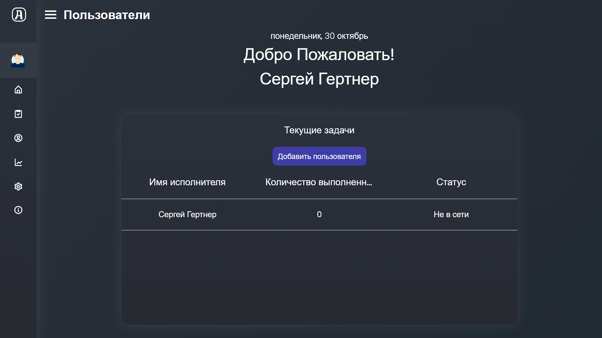
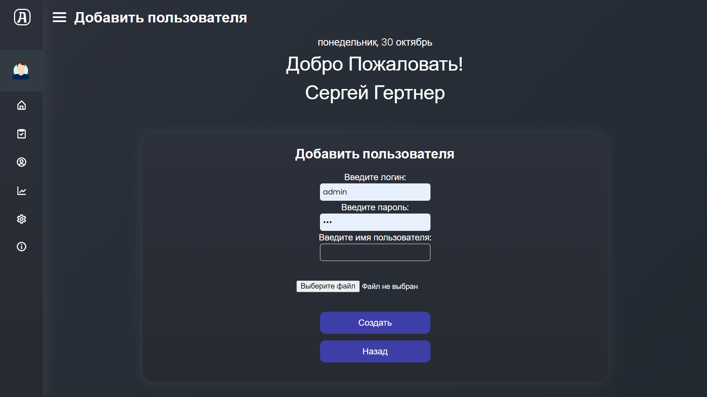

# Task Manager
Task Manager - это веб-приложение, разработанное для эффективного управления задачами и проектами.
Оно предназначено для команд, которые хотят организовать свою работу и следить за ходом выполнения задач.
Это приложение обеспечивает пользователей набором полезных функций и инструментов для оптимизации их рабочего процесса.

## Содержание
- [Технологии](#Технологии)
- [Использование](#Использование)
- [Запуск приложения](#Запуск-приложения)

## Технологии

- Язык программирования: Java, Web Technologies (HTML, CSS);
- Фреймворки и сторонние библиотеки: Spring Framework (Spring Boot, Spring Security, Spring Data JPA), Thymeleaf;
- База данных: PostgreSQL;
- Система контроля версий: Git;
- Сборщик проектов: Maven;

## Использование

С помощью Git Bash, перейдите в нужную папку и используя команду:

Скачайте репозиторий в выбранную Вами папку с помощью git команды:

```sh
$ git copy https://github.com/Reydel5212/ReydelBot
```

В файле "resources/application.properties", введите следующие значения:

```properties
# Укажите ссылку на свою базу данных
spring.datasource.url=
# Укажите логин
spring.datasource.username=postgres
# Укажите пароль
spring.datasource.password=12345
# Укажите Sql Driver
spring.datasource.driver-class-name=org.postgresql.Driver
```

### Создание билда 
Используя командную строку, перейдите в репозиторий проекта.
Далее, выполните следующую команду:

```sh
mvnw.cmd package // для Windows

mvnw package // для Linux 
```

### Запуск билда
После перейдите в папку target и выполните команду:

```sh
java -jar [название файла]
```

Подробнее о том, как запустить maven проект [по ссылке](https://spring-projects.ru/guides/maven/).

## Запуск приложения

При переходе по ссылке в адресной строке браузера, мы попадаем на
страницу авторизации, где требуется ввести логин и пароль пользователя,
чтобы получить доступ к сайту.



После успешной авторизации, пользователь попадает на главную
страницу, где его приветствует заголовок с текущей датой и его именем. В левой части
экрана находиться панель навигации, которая позволяет
пользователю переходить между страницами сайта. 

Цель главной страницы заключается в том, чтобы предоставить
пользователю возможность взаимодействовать с активными задачами.
Выбрав конкретную задачу, пользователь переходит на страницу с ее
подробным описанием и дополнительными деталями.



На данной странице предоставлена подробная информация о задании,
сопровождаемая тремя кнопками: "Сдать задачу", "Отменить" и "Назад".
Кнопка "Сдать задачу" перенаправляет пользователя на
страницу с отчетом, где ему необходимо описать процесс выполнения задачи,
предоставить конечный результат и приложить изображение при необходимости. 
После отправки отчета, задание будет сохранено в архиве 
и будет отображаться на странице со статистикой.
При выборе кнопки "Отменить", пользователь отказывается от
выполнения задания, а кнопка "Назад" возвращает пользователя к списку
заданий



Страница "Задачи"
отображает доступные для выполнения задания. Здесь пользователь
самостоятельно выбирает задачу, которую он хочет выполнить.



В архиве отображаются задачи, которые были проверены или
готовы для проверки. В центре страницы расположен счётчик, который
отображает количество задач, отправленных на проверку.
При выборе конкретной задачи, мы переходим на страницу с её
описанием. На этой странице содержатся информация о самой задаче, а также
отчет, который был отправлен исполнителем.



В "настройках" можно поменять цветовую палитру сайта. На данный момент представленно всего
три варианта. Данные сохраняются в cookie браузера, что позволяют сохранять изменения.



Страница новостей предоставляет пользователю возможность быть в
курсе последних событий. Она является полезным инструментом для быстрой
передачи важной информации о текущих или предстоящих событиях.



Администратору доступны следующие функции:
- Добавлять, удалять, изменять задачи;
- Добавлять, удалять, изменять пользователей;
- Проверять и отмечать задачи в статистике;
- Видоизменять новостной блок;



Функцию добавления задачи имеет только администратор. На странице
присутствует ограничение, которое не позволяет обычному пользователю
получить доступ к этой функции.



На странице с "исполнителями", администратору доступна информация о всех зарегистрированных
пользователях. Кроме того, представлена информация о статусе
пользователя в качестве исполнителя и общее количество выполненных им
задач. Администратор имеет возможность перейти на страницу выбранного
пользователя и внести изменения, нажав на кнопку "Редактировать".



Мы можем добавлять пользователей в базу данных - для этого нужно
перейти на страницу с формой, ввести всю необходимую информацию и
прикрепить изображение.
